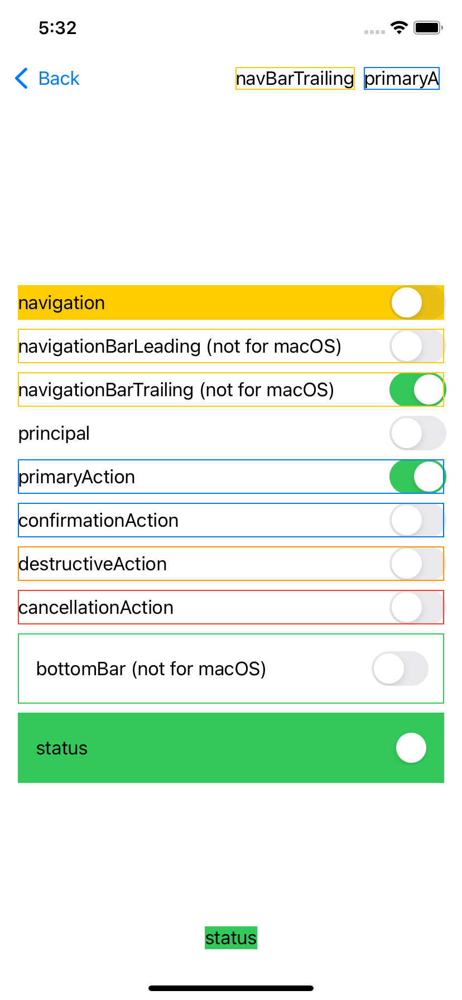
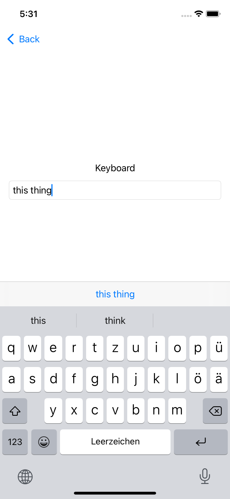
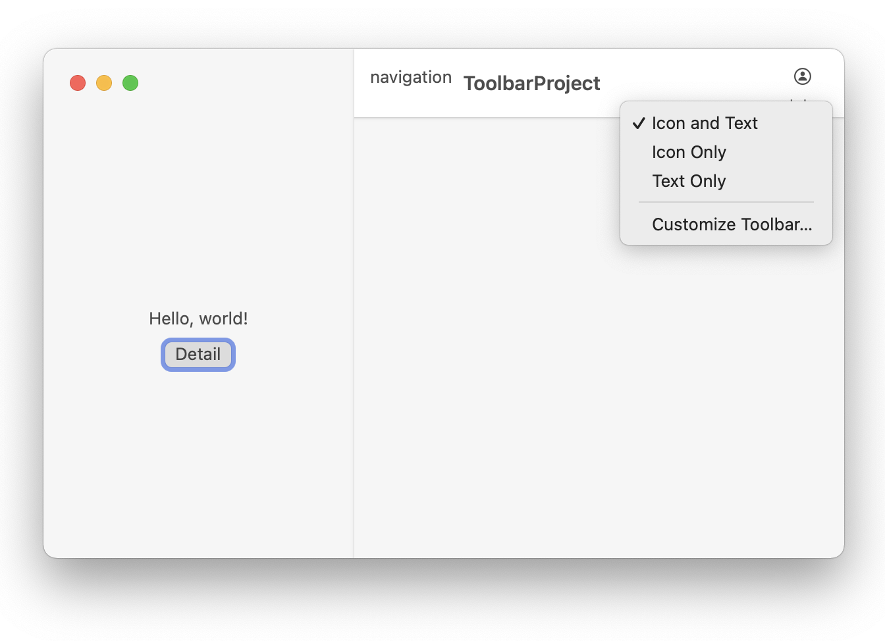

# ToolbarProject
Demonstrate the toolbar view modifier for SwiftUI with different placements

Youtube tutorial --> https://youtu.be/jTW5Z-kyL8g

## Use toolbar for iOS

## Toolbar with keyboard placement
can add e.g. Buttons above the keyboard area

## Use toolbar for macOs
 
 
# You can customize the toolbar with identifying

                .toolbar(id: "my toolbar", content: {
                    ToolbarItem(id: "navigation", placement: .navigation, showsByDefault: true) {
                        Text("navigation")
                    }
                )

 

